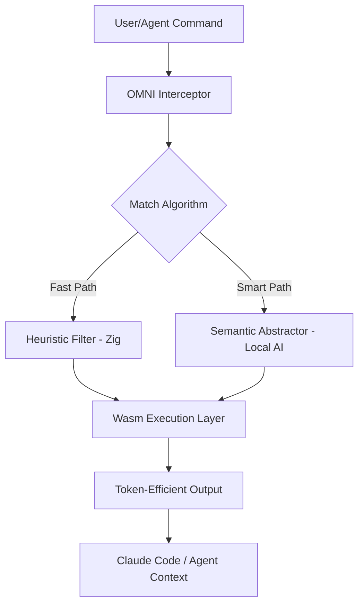

# OMNI Architecture Blueprint

## System Overview

OMNI is designed to be a universal, lightweight, and intelligent token optimization layer. Unlike its predecessors, OMNI utilizes an **Adaptive Filtering** architecture.

## Key Components

### 1. Interceptor Layer (The Shield)
- Integrated via `PRE_COMMAND` hook.
- Redirects matching commands to the OMNI Engine.

### 2. OMNI Engine (The Brain)
- **Zig Core:** Handles text parsing, regex, and raw data manipulation with high memory precision.
- **Wasm Runtime:** Executes filter modules that can be dynamically updated without updating the main binary.
- **AI-Locker:** Caches semantic abstraction results to prevent redundant processing.

### 3. MCP Gateway (The Bridge)
- Primary protocol for communication with Claude AI.
- Allows Claude to request specific compression modes in real-time.

## Tech Stack
- **Engine:** Zig (Targeting `wasm32-wasi`).
- **Interface:** TypeScript + Node.js (MCP SDK).
- **Automation:** Zig (for an ultra-lightweight and powerful build system).

## Development Philosophy
- **Performance First:** Startup overhead must be < 1ms (Edge Optimized).
- **Zero-Config:** Operates automatically upon installation.
- **Privacy:** All processing (including semantic summaries) must run locally.
