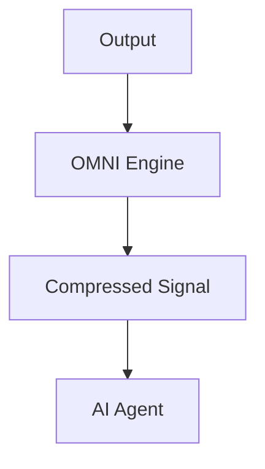

# OMNI Architecture Blueprint

## System Overview

OMNI is a universal token optimization layer utilizing an **Adaptive Filtering** architecture.

## Core Components

1. **Unified CLI**: High-performance binary for distillation and reporting.
2. **OMNI Engine**: Native Zig core providing high-speed semantic filtering.
3. **MCP Gateway**: Built-in support for the Model Context Protocol.

## Tech Stack
- **Engine**: Zig (Wasm)
- **Interface**: TypeScript / Node.js
- **Protocols**: MCP, Stdout, Stdin

## Philosophy
- **Speed**: < 1ms overhead.
- **Privacy**: Local-first processing.
- **Simplicity**: Zero-config operation.
